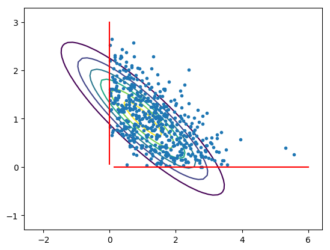

# Global BPS (Truncated Gaussian)

(*the code for this example can be found [here](https://github.com/alan-turing-institute/PDSampler.jl/blob/master/test/ex_gbps1.jl), note that the doc rendered here was automatically generated, if you want to fix it, please do it in the julia code directly*)

In this example we use the global Bouncy Particle Sampler on 2D Gaussian truncated to the positive orthan to show how to declare a BPS model.



Start by loading the library:

```julia
using PDSampler, Random

```
you then need to define two elements:
1. a geometry (boundaries)
2. an energy (gradient of the log-likelihood of the target)

The positive orthan corresponds to a simple Polygonal domain where the boundaries are the axes. The normal to these boundaries (`ns`) are therefore unit vectors and the intercepts (`a`) are zero.
A polygonal domain is then declared with the constructor `Polygonal`.

```julia
p = 2
# normal to faces and intercepts
ns, a = diagm(0=>ones(p)), zeros(p)
geom  = Polygonal(ns, a)

```
The function `nextboundary` returns a function that can compute the next boundary on the current ray `[x,x+tv]` with `t>0` as well as the time of the hit.

```julia
nextbd(x, v) = nextboundary(geom, x, v)

```
The model then needs to be specified: you need to define a function of the form
`gradll(x)` which can return the gradient of the log-likelihood at some point `x`.
Here, let us consider a 2D gaussian.

```julia
# here we build a valid precision matrix. The cholesky decomposition of
# the covariance matrix will be useful later to build a sensible
# starting point for the algorithm.
Random.seed!(12)
P1  = randn(p,p)
P1 *= P1'
P1 += norm(P1)/100*diagm(0=>ones(p))
C1  = inv(P1); C1 += C1'; C1/=2;
L1  = cholesky(C1).L
mu  = zeros(p) .+ 1.
mvg = MvGaussianCanon(mu, P1)

```
Here, we have defined the gaussian through the *Canonical* representation i.e.: by specifying a mean and a precision matrix.

Every model must implement a `gradloglik` function returning the gradient of the log-likelihood at a point `x`.

```julia
gradll(x) = gradloglik(mvg, x)

```
Next, you need to define the function which can return the first arrival time of
the corresponding Inhomogenous Poisson Process.

Note that you could be using `nextevent_zz` here as well if you wanted to use
the Zig-Zag sampler (and you could implement other kernels as well).

```julia
nextev(x, v) = nextevent_bps(mvg, x, v)

```
For a Gaussian (and some other simple distributions), this is analytical through
an inversion-like method.

Finally, you need to specify the parameters of the simulation such as the
starting point and velocity, the length of the path generated, the rate of
refreshment and the maximum number of gradient evaluations.

```julia
T    = 1000.0   # length of path generated
lref = 2.0      # rate of refreshment
x0   = mu+L1*randn(p) # sensible starting point
v0   = randn(p) # starting velocity
v0  /= norm(v0) # put it on the sphere (not necessary)
# Define a simulation
sim = Simulation( x0, v0, T, nextev, gradll,
                  nextbd, lref ; maxgradeval = 10000)

```
And finally, generate the path and recover some details about the simulation.

```julia
(path, details) = simulate(sim)

```
The `path` object belongs to the type `Path` and can be sampled using
`samplepath`.

A crude sanity check is for example to check that the estimated mean obtained through quadrature along the path yields a similar result as a basic Monte Carlo estimator.

```julia
# Building a basic MC estimator
# (taking samples from 2D MVG that are in positive orthan)
sN = 1000
s  = broadcast(+, mu, L1*randn(p,sN))
mt = zeros(2)
np = 0
# Sum for all samples in the positive orthan
ss = [s; ones(sN)']
mt = sum(ss[:,i] for i in 1:sN if !any(e->e<0, ss[1:p,i]))
mt = mt[1:p]/mt[end]

```
You can now compare the norm of `mt` (a crude MC estimator) to `pathmean(path)` (computing the integrals along the segments of the path) and you will see that
the relative error is below 5%.
